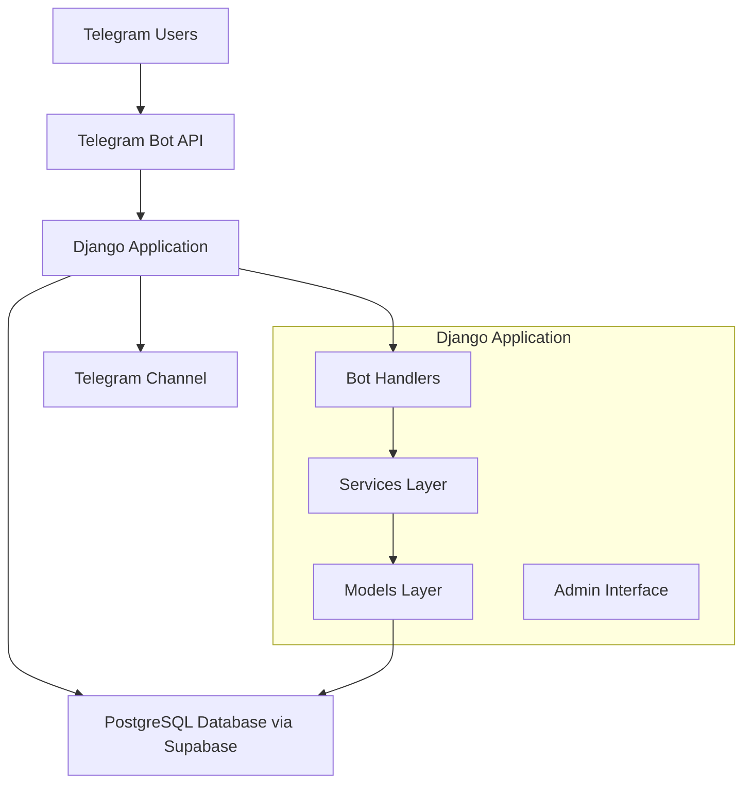
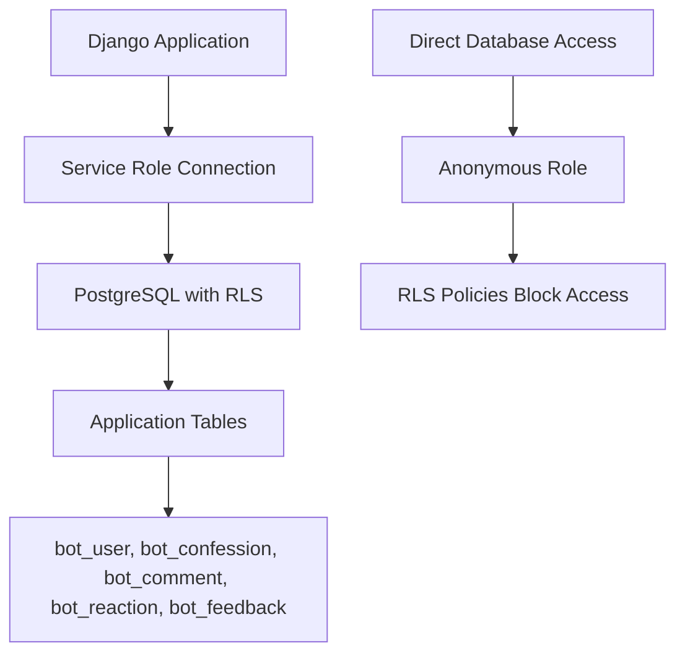

# Design Document: Anonymous Confession Bot

## Overview

The Anonymous Confession Bot is a Telegram-based system that enables users to submit confessions anonymously or with attribution, provides admin moderation capabilities, publishes approved content to a channel, and supports community engagement through comments and reactions. The system is built using Django with PostgreSQL (Supabase) as the database backend and includes comprehensive security measures including Row Level Security (RLS).

## Architecture

### High-Level Architecture



### Security Architecture



## Components and Interfaces

### Core Services

1. **UserService** (`bot/services/user_service.py`)
   - User registration and profile management
   - Anonymity settings control
   - Statistics calculation

2. **ConfessionService** (`bot/services/confession_service.py`)
   - Confession submission and management
   - Admin moderation workflow
   - Channel publishing

3. **CommentService** (`bot/services/comment_service.py`)
   - Comment creation and management
   - Reaction handling
   - Pagination support

4. **NotificationService** (`bot/services/notification_service.py`)
   - Admin notifications
   - User status updates

### Bot Handlers

1. **Command Handlers**
   - `/register`, `/profile`, `/confess`, `/comment`, etc.
   - Admin commands: `/pending`, `/stats`, `/delete`

2. **Callback Query Handlers**
   - Inline button interactions
   - Admin approval/rejection actions
   - Comment reactions and pagination

### Database Models

1. **User Model** - Extended Django User with bot-specific fields
2. **Confession Model** - Confession submissions with status tracking
3. **Comment Model** - User comments on confessions
4. **Reaction Model** - Like/dislike reactions on comments
5. **Feedback Model** - User feedback system

## Data Models

### User Model Extensions
```python
class User(AbstractUser):
    telegram_id = models.BigIntegerField(unique=True)
    first_name = models.CharField(max_length=100)
    username = models.CharField(max_length=100, blank=True)
    anonymous_mode = models.BooleanField(default=True)
    total_confessions = models.IntegerField(default=0)
    total_comments = models.IntegerField(default=0)
    impact_points = models.IntegerField(default=0)
```

### Confession Model
```python
class Confession(models.Model):
    user = models.ForeignKey(User, on_delete=models.CASCADE)
    text = models.TextField(max_length=4096)
    is_anonymous = models.BooleanField(default=True)
    status = models.CharField(max_length=20, choices=STATUS_CHOICES)
    channel_message_id = models.BigIntegerField(null=True, blank=True)
    created_at = models.DateTimeField(auto_now_add=True)
    reviewed_at = models.DateTimeField(null=True, blank=True)
    reviewed_by = models.ForeignKey(User, null=True, blank=True)
```

### Comment Model
```python
class Comment(models.Model):
    confession = models.ForeignKey(Confession, on_delete=models.CASCADE)
    user = models.ForeignKey(User, on_delete=models.CASCADE)
    text = models.TextField(max_length=1000)
    parent = models.ForeignKey('self', null=True, blank=True)
    likes = models.IntegerField(default=0)
    dislikes = models.IntegerField(default=0)
    reports = models.IntegerField(default=0)
    created_at = models.DateTimeField(auto_now_add=True)
```

### Reaction Model
```python
class Reaction(models.Model):
    comment = models.ForeignKey(Comment, on_delete=models.CASCADE)
    user = models.ForeignKey(User, on_delete=models.CASCADE)
    reaction_type = models.CharField(max_length=10, choices=REACTION_CHOICES)
    created_at = models.DateTimeField(auto_now_add=True)
```

### Feedback Model
```python
class Feedback(models.Model):
    user = models.ForeignKey(User, on_delete=models.CASCADE)
    text = models.TextField(max_length=2000)
    status = models.CharField(max_length=20, choices=STATUS_CHOICES)
    created_at = models.DateTimeField(auto_now_add=True)
    reviewed_at = models.DateTimeField(null=True, blank=True)
    reviewed_by = models.ForeignKey(User, null=True, blank=True)
    admin_notes = models.TextField(max_length=1000, blank=True)
```

## Database Security Design

### Row Level Security (RLS) Implementation

All application tables must have RLS enabled with the following policy structure:

1. **Service Role Policies**: Allow full access (SELECT, INSERT, UPDATE, DELETE) for the authenticated service role used by the Django application
2. **Anonymous Role Policies**: Deny all access for anonymous/public database connections

### Security Policy Template

For each table (bot_user, bot_confession, bot_comment, bot_reaction, bot_feedback):

```sql
-- Enable RLS
ALTER TABLE public.{table_name} ENABLE ROW LEVEL SECURITY;

-- Service role full access
CREATE POLICY "Service role has full access to {table_name}" 
ON public.{table_name}
FOR ALL
TO authenticated
USING (true)
WITH CHECK (true);

-- Deny public access
CREATE POLICY "Public has no access to {table_name}" 
ON public.{table_name}
FOR ALL
TO anon
USING (false);
```

### Database Connection Security

- Django application connects using service role credentials
- Service role bypasses RLS policies for normal application operations
- Direct database access without proper authentication is blocked by RLS
- All sensitive credentials stored in environment variables

## Correctness Properties

*A property is a characteristic or behavior that should hold true across all valid executions of a system-essentially, a formal statement about what the system should do. Properties serve as the bridge between human-readable specifications and machine-verifiable correctness guarantees.*

### Property 1: User Registration Uniqueness
*For any* user registration attempt, the system should create a unique user profile with properly initialized default settings (all counters at zero, anonymous mode enabled)
**Validates: Requirements 1.1, 1.5**

### Property 2: Anonymity State Management
*For any* user and anonymity toggle command, the system should update the user's anonymity setting and apply it to future confessions
**Validates: Requirements 1.2, 1.3, 2.3**

### Property 3: Confession Submission Creates Pending Record
*For any* valid confession text (under 4096 characters), submission should create a confession record in pending state and notify all admins
**Validates: Requirements 2.2, 2.4, 3.1**

### Property 4: Character Limit Enforcement
*For any* confession text exceeding 4096 characters, the system should reject the submission and inform the user of the limit
**Validates: Requirements 2.5**

### Property 5: Admin State Transitions
*For any* pending confession and admin action (approve/reject), the system should change the confession state appropriately and trigger the correct follow-up actions (publish to channel or notify user)
**Validates: Requirements 3.2, 3.3**

### Property 6: Channel Publishing Requirements
*For any* approved confession, the channel post should contain the confession text, confession ID, appropriate author attribution, and a "View / Add Comments" button
**Validates: Requirements 4.1, 4.2, 4.3, 4.4, 4.5**

### Property 7: Comment Creation and Linking
*For any* comment submission, the system should store the comment with proper references to the confession and commenter, and provide reaction buttons
**Validates: Requirements 5.3, 5.5**

### Property 8: Reaction Counting Accuracy
*For any* reaction action (like/dislike/report) on a comment, the system should increment the appropriate counter and trigger admin notifications when report thresholds are exceeded
**Validates: Requirements 5.6, 5.7, 5.8**

### Property 9: Profile Information Completeness
*For any* user profile request, the display should contain all required statistics (confessions, comments, impact points, acceptance score) with accurate calculations
**Validates: Requirements 1.4, 6.1, 6.4, 6.5**

### Property 10: Database Connection Resilience
*For any* database connection failure, the system should retry up to three times with exponential backoff and handle connection strings with special characters
**Validates: Requirements 7.2, 7.3**

### Property 11: Transaction Error Handling
*For any* failed database transaction, the system should roll back the transaction and log appropriate error details
**Validates: Requirements 7.5**

### Property 12: RLS Security Enforcement
*For any* application database table, Row Level Security should be enabled with policies allowing service role access and denying anonymous access
**Validates: Requirements 8.1, 8.2, 8.3, 8.9**

### Property 13: Error Response Consistency
*For any* invalid user input (commands, confession IDs, admin actions without privileges), the system should provide helpful error messages and appropriate guidance
**Validates: Requirements 9.1, 9.2, 9.3**

### Property 14: Success Feedback Reliability
*For any* successful user action (confession submission, comment creation), the system should provide clear confirmation feedback
**Validates: Requirements 9.5**

## Error Handling

### Database Error Handling
- Connection retry logic with exponential backoff
- Transaction rollback on failures
- Comprehensive error logging
- User-friendly error messages

### Input Validation
- Character limits on all text inputs
- Confession ID validation
- Admin permission checking
- Command parameter validation

### Telegram API Error Handling
- Rate limiting compliance
- Message sending failure recovery
- Webhook reliability measures

## Testing Strategy

### Dual Testing Approach

The system employs both unit testing and property-based testing to ensure comprehensive coverage:

**Unit Tests:**
- Verify specific examples and edge cases
- Test integration points between components
- Validate error conditions and boundary cases
- Cover specific user workflows

**Property-Based Tests:**
- Verify universal properties across all inputs using Hypothesis
- Each property-based test runs a minimum of 100 iterations
- Tests are tagged with comments referencing design document properties
- Format: `**Feature: anonymous-confession-bot, Property {number}: {property_text}**`

### Property-Based Testing Library
The system uses **Hypothesis** for Python property-based testing, which provides:
- Automatic test case generation
- Shrinking of failing examples
- Stateful testing capabilities
- Integration with Django test framework

### Testing Requirements
- Each correctness property must be implemented by a single property-based test
- Property-based tests must be tagged with explicit references to design properties
- Unit tests complement property tests by covering specific examples
- All tests must pass before deployment

### Security Testing
- RLS policy verification
- Database access control testing
- Authentication and authorization testing
- Input sanitization validation

## Deployment and Infrastructure

### Vercel Deployment
- Automatic migration execution via build script
- Environment variable configuration
- Static file handling
- Webhook endpoint configuration

### Supabase Integration
- PostgreSQL database hosting
- Connection pooling
- Row Level Security implementation
- Real-time capabilities (future enhancement)

### Environment Configuration
- Secure credential management
- Admin user configuration
- Channel ID configuration
- Database connection parameters

## Monitoring and Maintenance

### Logging Strategy
- Comprehensive error logging
- User action tracking
- Performance monitoring
- Security event logging

### Database Maintenance
- Regular backup procedures
- Index optimization
- Query performance monitoring
- Storage usage tracking

### Bot Health Monitoring
- Webhook status monitoring
- Message processing metrics
- Error rate tracking
- User engagement analytics